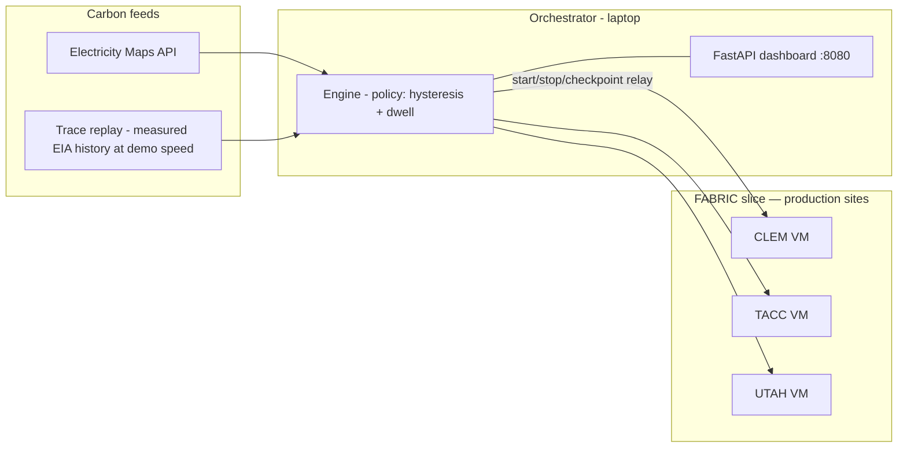

# Carbon Chaser — the legacy hand-rolled orchestrator

**This is not what the MERIF demo runs.** The current demo is a
Pegasus/HTCondor workflow, documented in [README.md](README.md); this file
covers the *pre-Pegasus* orchestrator in `carbon_chaser/` — an external
control loop that stops, checkpoints and resumes a trainer over SSH.

It is kept for two reasons:

* **The no-testbed fallback.** `--mode sim` replays measured carbon traces on
  a laptop with no FABRIC slice, which is the venue safety net if the pool is
  unreachable.
* **The measured migration-cost history.** Its findings — transfer setup vs
  throughput, the three-part downtime decomposition, SSH backgrounding
  behaviour — carried directly into the workflow design and are the reason
  the current demo prices a migration the way it does. They stay documented
  here rather than being deleted with the code path.

Config, carbon traces and the measured-vs-modeled data provenance rules are
shared with the current demo — see
[README.md](README.md#data-provenance--what-is-measured-vs-modeled).

## Architecture



- **Workload** (`carbon_chaser/workload/train.py`): self-contained numpy
  trainer with atomic checkpoint/resume — a stand-in for any real job that
  honors the same two-file contract (`checkpoint.npz`, `progress.json`).
- **Engine** (`engine.py`): migrates when the cleanest site beats the current
  one by ≥ 60 gCO₂/kWh and the job has dwelled ≥ 15 sim-minutes (hysteresis,
  no flapping). Integrates emissions for the chasing job **and** a
  stay-at-home baseline from the same intensity series — the difference is
  the headline "CO₂ saved" number.
- **Executors** (`executor.py`): `LocalExecutor` runs everything on the
  laptop in per-site sandboxes (dev + venue fallback); `FabricExecutor`
  drives one VM per site on a FABRIC slice via fablib, moving checkpoints
  **node-to-node over FABNetv4** so the bytes cross the same inter-rack
  links the network model prices. Every transfer is labeled `dataplane`,
  `relay` (fallback through the orchestrator's management connection), or
  `local` — and **only `dataplane` transfers calibrate the model**, so a
  fallback path can never masquerade as a network measurement.
- **Carbon feeds** (`carbon.py`): Electricity Maps (set `EMAPS_TOKEN`) or
  **replay of measured EIA history** at demo speed. There is no simulator
  and no spike injector — every earlier iteration was bitten by synthetic
  values passing as measurements, so the synthetic paths were deleted; the
  one remaining booth control is a forced migration, which is a real action
  with real measured cost.
- **Live dataplane telemetry** (`fabric_metrics.py`): queries FABRIC's
  public metrics API (anonymous Grafana datasource proxy →
  `dataplaneIn/OutBits` per inter-rack link) to build the real link graph,
  find the rack path between sites, and price the checkpoint transfer from
  current bottleneck headroom. The engine **vetoes** a migration whose
  predicted downtime (`overhead_s` + transfer) exceeds `max_downtime_s` and
  falls through to the next-cleanest site — carbon-aware *and*
  network-aware. Measured throughput from completed dataplane transfers
  feeds back as an EWMA rate hint, so predictions converge on what scp
  actually achieves rather than on raw link headroom (an optimistic hint
  can never raise the assumed rate above headroom). Each migration records
  predicted vs. actual downtime — the residual is the paper's model-accuracy
  result. Fail-open: if the API is unreachable, policy is carbon-only
  (booth safe).

### One trainer, always

Two trainers advancing the same checkpoint lineage would diverge silently
and burn power the accounting attributes to one node, so single-instance
execution is enforced rather than assumed:

- **The workload owns the guarantee.** `train.py` takes an `flock(2)` lock
  on its workdir at startup and exits 3 if another trainer holds it, so a
  duplicate is refused by the kernel no matter who launched it — this
  executor, a stale run, or a person on the node by hand. `is_running()`
  asks the lock rather than `pgrep` (whose patterns also match shell
  wrappers). The Python `fcntl` lock and an external `flock -n` probe are
  the same mechanism, so the remote check works without a wrapper process.
- **"Unreachable" is not "idle."** A node that answers neither yes nor no
  may still be running the job. Unknown state is resolved, not assumed: on
  startup the engine tries to stop such a node, and if it cannot confirm,
  it refuses to start anywhere and says why. It only blocks when there is
  evidence — the persisted last-active site (`runs/engine_state.json`) — so
  a node down for maintenance that never held the job doesn't ground the
  demo.
- **A failed start does not mean a dead target.** `start()` raises when it
  cannot *confirm* the lock, which is weaker than "did not start". So an
  aborted migration will not resume at the source until the target is
  confirmed stopped; otherwise it reports `down` and names the site to
  clear.
- **A migration that cannot confirm the source stopped does not proceed.**
  `stop()` returns True only on confirmation; otherwise the move is aborted
  and the job stays put — better a missed migration than two live trainers.
- **A stall is diagnosed before it is "fixed".** No-progress has three
  causes; only one is fixed by starting a trainer. If the node is
  unreachable the engine explicitly does *not* start another (that is how
  duplicates happen); if the trainer is alive but wedged, it is stopped
  first.
- **Startup reconciles.** Restarting the orchestrator adopts a trainer
  that is already running (converging on the furthest-along one if several
  are up) instead of adding another.
- **Evidence outlives the orchestrator.** The active site is replicated to
  every reachable worker (`job/active_site`), not just to the orchestrator's
  own state file. Moving the control plane to a new host — laptop → control
  node — leaves that host with an empty state file while the slice's
  trainers are exactly where they were, so host-local evidence would
  silently vanish at precisely the moment it matters most. If a prior run is
  detectable but its location cannot be pinned down, every unreachable node
  is treated as a suspect and startup refuses (override with
  `--force-start` only when you know they are idle). A genuinely cold slice
  still starts normally, even with a node down.
- **A refusal actually holds.** `run()` promotes the engine to "running"
  only when reconciliation clears it. This matters because the tick loop
  gates migrations *and* restarts on that flag — setting it unconditionally
  would print the refusal and then start the very duplicate it refused, one
  tick later. The booth force-migrate button is rejected while blocked too.
  A background retry (`policy.reconcile_retry_s`, default 30 s) releases the
  block on its own once the node is reachable and verifiably idle, so a
  transient blip doesn't need an operator.

Verified in an Ubuntu 22.04 container against the exact command strings the
executor generates (duplicate start refused, external `flock` probe sees the
trainer's own lock, kill pattern does not signal its own shell, restart
resumed from checkpoint), and live on the laptop: killing only the
orchestrator left the trainer orphaned, and the restarted orchestrator
**adopted it** — one trainer throughout, training uninterrupted.

### Not losing work

"Never lost a step" is a claim the code has to earn, and safety logic can
break it:

- **Restart resumes from the furthest-along checkpoint**, not the configured
  `start_site`. Starting at `start_site` discards however far the job had
  got, and the next migration then copies that near-zero checkpoint over a
  good one, making the loss permanent. Observed on the testbed: a restart
  threw away ~167k steps exactly this way.
- **A migration refuses to overwrite newer, further-along work.** But
  "further along" alone is not the test — a site the job visited earlier can
  hold a high-step checkpoint from an abandoned branch, and refusing on step
  count alone would lock the job out of that site forever (UTAH kept a 70k
  checkpoint from a branch a bad restart orphaned). Only a checkpoint that is
  both further along *and* more recent counts as work worth protecting.
- **A recovered job is marked healthy again.** Health has to be cleared on
  recovery, not just set on failure: emissions accounting freezes while
  health is `down`, so a job left marked down would run with its CO₂
  counters stopped and the headline number would quietly drift wrong.
- **Transfers stage, verify by digest, then commit — and the commit is
  checked.** A checkpoint lands on `checkpoint.npz.incoming`; its **md5 and
  size** are compared against the source; only then is it moved into place,
  and the move must prove itself by printing the committed size. Cleanup
  therefore removes *only* the staging file, which is safe on every abort
  path.

  Two weaker versions of this were wrong in ways worth remembering. Size
  equality is not integrity — a same-length corruption passes and gets
  loaded as model weights. And `_exec` does not raise on a non-zero exit, so
  an unchecked `mv` fails **silently**: the transfer would be reported as a
  successful dataplane migration while the target still held its old
  checkpoint, the job would resume from stale weights, and the bogus
  measurement would feed the calibration model.

  Verification costs about four extra SSH round trips per migration
  (measured: downtime rose from ~3.6 s to ~7.6 s on FABRIC). That is real
  migration cost and it is now measured rather than hidden.

  This replaced a rule that tried to reason about when the target file
  "must" be broken, and got it wrong twice: discarding on all aborts deleted
  intact checkpoints (including, on the refuse-to-overwrite path, the exact
  one the abort existed to protect), and discarding on transfer failure
  alone still deleted an intact checkpoint whenever the transfer failed
  before writing a byte — a refused connection or a watchdog timeout. The
  invariant that actually holds: **the only thing ever deleted is a file
  this migration itself wrote.**

### Failure honesty

The engine never reports a healthy running job when there isn't one. A
failed migration restarts the workload at the **source** (the transfer is a
copy, so that checkpoint is still valid), discards any partial checkpoint at
the target, and records the attempt as `aborted`. If even the source won't
restart, `health` goes to `down`, the dashboard shows a red banner instead
of a green "running" badge, and the emissions counters **freeze** — a
stopped job burns nothing, and crediting it savings for downtime would
flatter the comparison.

A stall detector covers the general case (VM reboot, OOM kill, wedged node):
if training steps stop advancing while we claim to be running, the engine
says so and attempts one restart. Verified live by `SIGKILL`ing the trainer
under a running engine — the dashboard went `stalled`, the restart resumed
from the checkpoint, and health cleared once steps advanced.

```bash
python tests/test_migration_recovery.py   # 7 tests, no testbed needed
```

### Hang safety

Every node operation is bounded twice: coreutils `timeout` on the remote
side (not fablib's `timeout=`, which wraps commands in `sudo timeout` and
would run scp as root), plus a local watchdog thread in case the SSH channel
itself wedges. scp runs with `BatchMode=yes` (never prompts), `ConnectTimeout`,
and `ServerAlive` probes, so a black-holed FABNet path fails fast instead of
stalling — and the relay fallback actually gets to run. `get_progress()` is
on the engine tick loop, so it is bounded short and degrades to `None`
rather than freezing the dashboard. `tests/test_transfer_timeouts.py`
asserts all of this against fake nodes that block forever:

```bash
python tests/test_transfer_timeouts.py
```

### Measurement validity

The veto is only meaningful if the checkpoint really traverses the priced
path. Three guards enforce that: `create_slice.py` attaches FABNetv4 to
every node and **verifies pairwise reachability**, `main.py` warns loudly if
`dataplane_ips.yaml` is missing (all transfers would relay), and the engine
refuses to calibrate on anything but a `dataplane` transfer. In sim mode
transfers are local file copies, so `measured_rate_gbps` stays null by
design.

## Carbon feed handling — the engine and its dashboard

Every symbol named below lives in `carbon_chaser/` — `carbon.py`,
`engine.py`, and the FastAPI dashboard in `carbon_chaser/static/` — so
these are post-mortems on the **legacy** implementation. The rules they
established are shared with the current demo; see
[README.md](README.md#data-provenance--what-is-measured-vs-modeled).

**The source is planned before the clock is built.** `plan_carbon_source()`
decides trace/live/simulated first, then the clock follows that decision —
1× only for a live feed, accelerated otherwise. Choosing the clock from the
presence of `EMAPS_TOKEN` while the provider preferred a trace replayed
measured history at 1× and silently discarded `--accel`.

**A trace must cover every configured zone.** Coverage is validated up
front, because `fetch_traces.py` skips zones that error out and a partial
trace is therefore easy to produce. Left to run, the missing zone raised on
every tick and blanked *all* readings — zero history, zero intensities, and
the engine still reporting `status: running, health: ok`. A rejected trace
falls back with the missing zones named, and the fallback provider states
that real data was requested and unavailable, so a failed measurement never
reads as a deliberate simulation. Per-zone reads with last-known fallback
keep one bad zone from taking down the rest of the map.

**Being drawn differently is not the same as being visible.** Styling stale
runs as dashed lines still hid short episodes: one stale tick produced an SVG
path of a single `moveto`, which draws nothing at all, so the classic
intermittent-timeout pattern was completely invisible while the solid line's
sub-pixel gaps read as continuous. The chart therefore classifies **edges**
(an edge is measured only if both endpoints were), so a lone stale sample
draws dashed segments to its neighbours — and a per-tick **data-quality
ribbon** under the axis (amber = stale, red = no reading) stays visible
regardless of episode length or chart width. `tests/test_dashboard_render.py`
asserts this against the real DOM, because invisibility is invisible to
state-level tests.

**Stale is a third state, not a flavour of fresh.** A stale reading still
has a number, so any test of the form "does it have a value?" treats it as a
measurement. Each site reports `data`: `fresh` / `stale` / `missing`, each
history point records which samples were carried over, and the UI draws all
three differently — a dashed faded marker labelled `556 g · stale`, an
asterisked amber table value, and chart series split into solid (measured)
and dashed-faded (carried over) paths so a stale plateau cannot read as a
flat measurement.

**Unknown is `null`, never `0`.** Zero is a legitimate reading — a fully
renewable grid — so it must never double as "no data". Reporting a missing
reading as 0 made an outage paint every site as the *cleanest possible*
grid, since the colour ramp maps 0 to its lightest step. Each site now
carries `intensity` (nullable) plus `data`: `fresh` / `stale` / `missing`,
and the UI renders unknown as unknown: a hollow dashed marker labelled "no
data", `—` in the table, chart lines that **break** across gaps rather than
interpolating through them or spiking to the floor, and `—` in the tooltip.

**A dead feed is stated, not absorbed.** Carbon-feed condition
(`carbon_status`: ok / stale / unavailable) is tracked separately from job
health, because they answer different questions and one kept clobbering the
other — advancing training steps prove the *job* is alive and say nothing
about the feed, so the liveness check was silently clearing outage
verdicts. Only **fresh** readings may move the emissions counters or justify
a migration: a stale value may still be *displayed* briefly (bounded by
`policy.carbon_max_stale_s`), but counting it would invent CO₂ that was
never measured. Past the bound the reading is withdrawn rather than shown
indefinitely as current, and the dashboard greys the headline number and
says why it is paused.

## Quickstart — local trace replay (no FABRIC needed)

```bash
python3 -m venv .venv && source .venv/bin/activate
pip install -r requirements.txt
python -m carbon_chaser.main --mode sim
# open http://localhost:8080
```

At the default 120× acceleration a replayed hour passes every 30 s, so the
CAISO solar dip and evening peaks sweep through in minutes and organic
migrations happen every few minutes. The one booth control on the dashboard
is **▶ move job** — a forced migration, which is a real action with real
measured cost (there is no spike injector; fabricated grid events were
deleted with the rest of the synthetic paths).

## On FABRIC — validated 2026-08-24

Ran end to end on the production testbed (CLEM/TACC/UTAH): slice created,
all six FABNetv4 pairs reachable, job adopted on orchestrator restart, and
**real checkpoint migrations over the dataplane** (12 KB in ~1.5 s,
`tacc → star → wash → clem`, 3.6 s total downtime, training resumed without
losing a step).

Three things only a live run revealed:

1. **Backgrounding must use a subshell.** `setsid nohup … &` keeps the SSH
   channel open until the trainer exits, so the call blocks for its whole
   watchdog even though the trainer started fine — measured 40 s+ vs 0.2 s
   for `( setsid … & )`. The remote `timeout` cannot save you here: the
   wrapper has already exited and the orphan holds the fd. Symptom is
   nasty because it looks like a failed start while the job is running.
2. **Downtime has three parts, and they must be measured separately.**
   `downtime = orchestration + setup + bytes/bandwidth`. A 12 KB checkpoint
   moving in 1.5 s measures *setup*, not throughput — treating it as a rate
   predicted ~10 days for 8 GB. And the transfer duration is not the whole
   fixed cost either: on FABRIC a 1.5 s transfer sat inside a 3.6 s
   downtime, the extra ~2.1 s being stop + start. Calibrating overhead from
   the transfer alone underestimated downtime by more than half, which
   would let the veto pass migrations it should refuse. Measured on the
   testbed: setup ≈ 1.34 s, orchestration ≈ 2.18 s, and after one migration
   predictions land within 3% (3.6 s predicted vs 3.5 s actual). Until
   anything is measured the model uses the conservative configured
   constant, erring toward refusing a migration rather than blowing the
   budget.
3. **SSH latency is not the bottleneck** — 0.2 s per command once the
   connection is up, so per-tick probing is cheap.

Known tuning note: the replay acceleration compresses
`policy.min_dwell_min`, which is in *replayed* time. At 900× a 15-minute
dwell is one real second, so the job can bounce. For a booth use 120–300×.

```bash
pip install -r requirements-fabric.txt   # fablib
python fabric/create_slice.py            # 1 small VM at CLEM, TACC, UTAH
python -m carbon_chaser.main --mode fabric
python fabric/delete_slice.py            # teardown after the demo
```

### Dashboard on the testbed (control plane inside FABRIC)

```bash
python fabric/add_control_node.py --site STAR   # adds CTRL, deploys the app
# then, on CTRL:
python3 -m carbon_chaser.main --mode ssh --accel 300 --port 8080
# view from a laptop (FABRIC management is IPv6-only):
ssh -L 8091:localhost:8080 ubuntu@<CTRL-management-ip>
```

`--mode ssh` uses `SshExecutor`, which reaches workers by their FABNetv4
addresses with the shared relay key — no fablib, no FABRIC token on the
node, no bastion hop. Checkpoints still move worker-to-worker and never
transit the control node. This keeps the whole control plane on FABRIC's
network rather than the operator's home link, and the demo survives laptop
trouble.

Live carbon data instead of the simulator (works in either mode):

```bash
export EMAPS_TOKEN=...    # free personal tier at electricitymaps.com
python -m carbon_chaser.main --mode fabric
```

Note: with the live feed the clock runs at 1× and real grids move slowly —
for a 2-hour booth slot, run the simulator feed against the real FABRIC
slice (default when `EMAPS_TOKEN` is unset): real VMs, real migrations,
compressed carbon weather.
